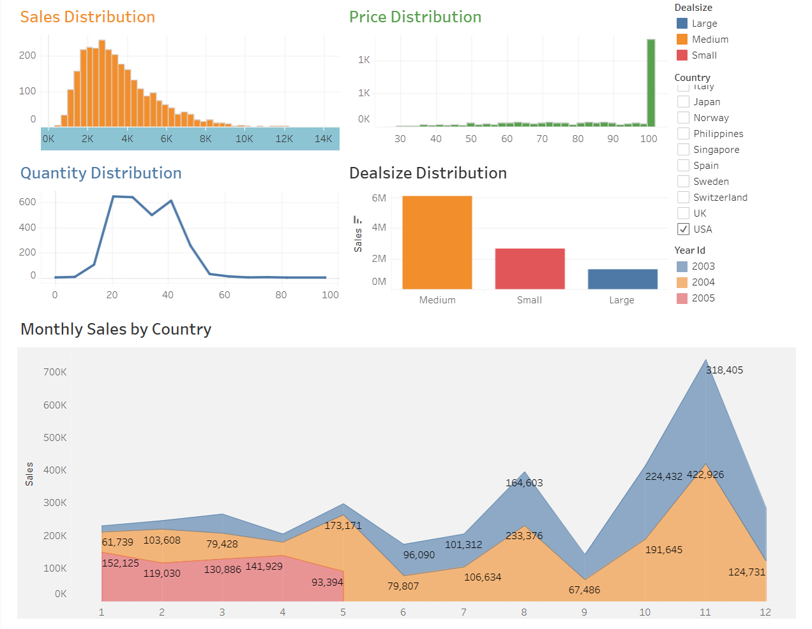

# Matt Transportation Company Sales Analysis

# Objective
In this project, I used SQL to analyze sale data based on product line, monthly and yearly trends. I apply the RFM Analysis technique to identify the best customer. In addition, I employed Tableau to explore distribution trends and extract further insights regarding revenue performance.  

# About Data Set
This data set provides detailed information about orders, including order numbers, quantities ordered, prices per unit, and order status. It also contains customer information, such as names, contact details, and geographic location. Additionally, the data includes product-specific details like product lines, codes, and suggested retail prices, making it suitable for sales and customer analysis. 
[Data Set](https://github.com/thucnhii/SQLProjectSaleAnalysis/blob/6152c6eabab6c54f7b1f2ed0f87e3930bf09fb12/sales_data_sample.csv)  

# Analyzing
[SQL Queries](https://github.com/thucnhii/SQLProjectSaleAnalysis/blob/34fb2d3d8f9037d42c8acc6baf6f0a28fff2a2bb/AnalysisSQL.sql)  
- Sales by Product Line, Year, and Dealsize.
- Identify best month for sales and the highest sale product in that month.
- Segment customers and find the best customer
- Find products are most often sold together  

# Visualizing
[Tableau](https://public.tableau.com/app/profile/nhi.le8767/viz/MattTransportationSalesAnalysis/MattSalesAnalysis)

